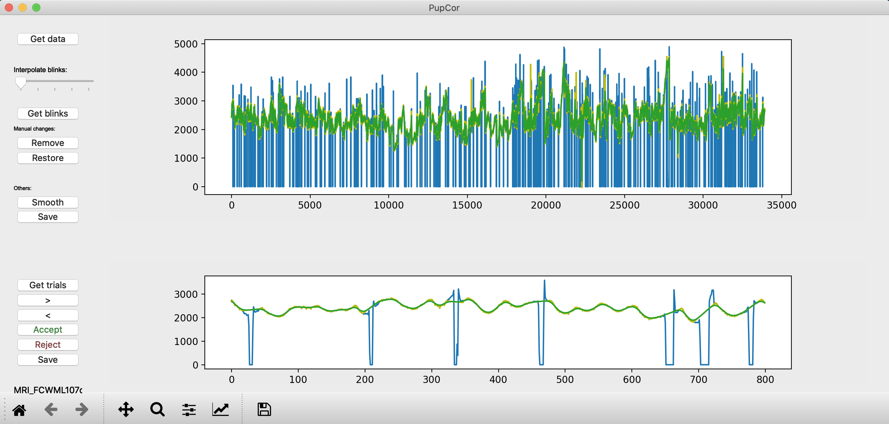

# PupCor
a simple python-based GUI to preprocess and manually correct pupil data 

You just need to download the "PupCor_v1.py" file and install the dependencies.

It is a very simply nothing fancy, easy to use GUI to get interpolated (and smoothed) pupil data [coming from the EyeLink for now other formats will be suported at a later stage]. In addition there is an option to go through the time course on a trial-by-trial basis, for which you need a file containing the times of the markers (eg onset of your stimuli). You can use this to manually accept or reject trial in case the data for that trial is not usable (eg someone closed there eyes for some time).

# TIME COURSE
These are the steps you can follow:

1) PupCor requires the pupil data to be in an .asc file. You would first need to convert to .edf files to .asc using the 

2) The "Get blinks" button can be used to interpolate eye blinks, there is a slider that can be used to change the length of the interpolation

3) "Remove" can be used to manually interpolate a piece of data. Zoom in to the part you would like to interpole and click "Remove"

4) "Restore" can be used to restore the interpolated data to go back to the raw data

5) "Peak frequency" slider can be used to change the distance between peak to be detected, you can use this to see if the peak detection gets better with a different freqiuency. It us adviced to do that before starting with manual correcting

6) "Save" will save the interpolated an smoothed data in a new file in a folder called "Pup_output" which is located in the folder your original file is

> you can save throught the correction and you can even close the file and when re-opening it it will load the interpolated an smoothed data.

# TRIAL DATA
These are the steps you can follow:

1) Select a .txt file that contains one column with times (ie should be in the sample frequency of the time course)

2) With the "<" and ">" arrows you can click though the trials

3) With "Accept" and "Reject" you can accept or reject a trail. If you reject a trial the data will be plotted in gray.

4) "Save" it will output a file with 1 and 0 corresponding with your Accept and Reject decision

This is an example of how the GUI looks like:

